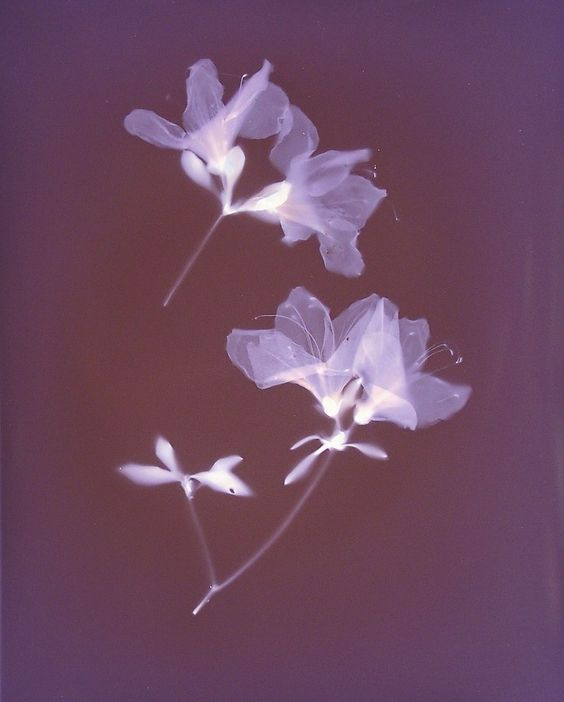
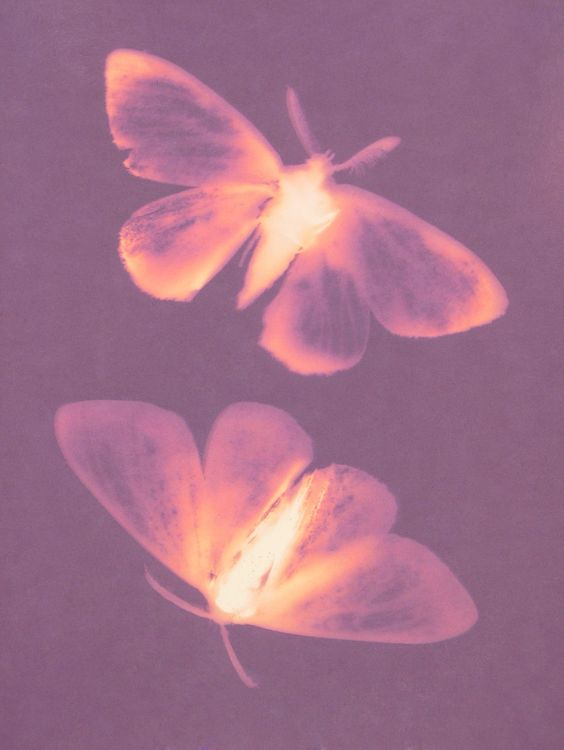

# yren0434_9103_tut
Week8

**Imaging Technique Choice:** 
I drew inspiration for my imaging technique from these unique plant and insect photography works. They feature the use of high-contrast colors combined with soft gradation effects, creating a hazy and dreamlike atmosphere. In particular, their transparency and lighting treatment give the impression of floating in the air. 

**Why it's useful:** 
This imaging technique can inspire me in my design projects to think about how to create similar haziness through the handling of light and transparency. This technique is particularly suitable for projects that need to show soft effects and gradual colors, and helps enhance the image's sense of depth and visual appeal.

**Coding Technique Choice: p5.js**
I chose p5.js as the coding tool to help implement this imaging technique. p5.js can achieve color gradients and transparency effects with simple code, simulating similar light and depth effects. In particular, its alpha value adjustment and lerpColor() function can effectively achieve the gradual transparency effect in the image, making the flowers and insects in the picture look more three-dimensional and lightweight.

[Link Text](https://p5js.org/reference/p5/lerpColor/)
[Link Text](https://p5js.org/reference/p5.Color/setAlpha/)